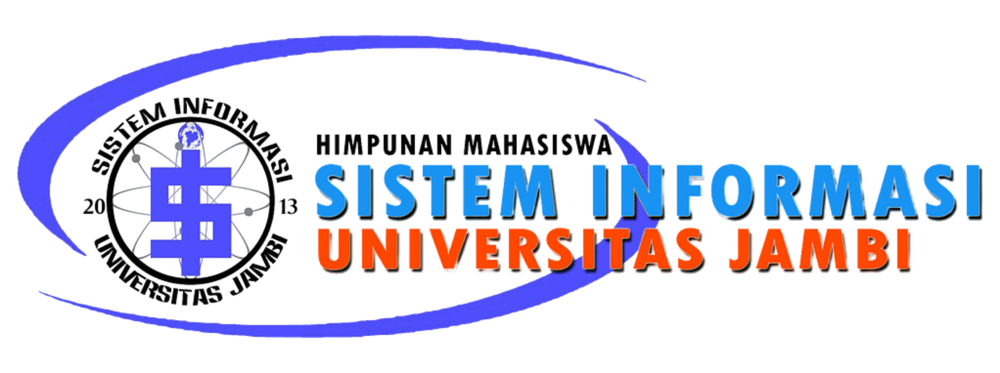
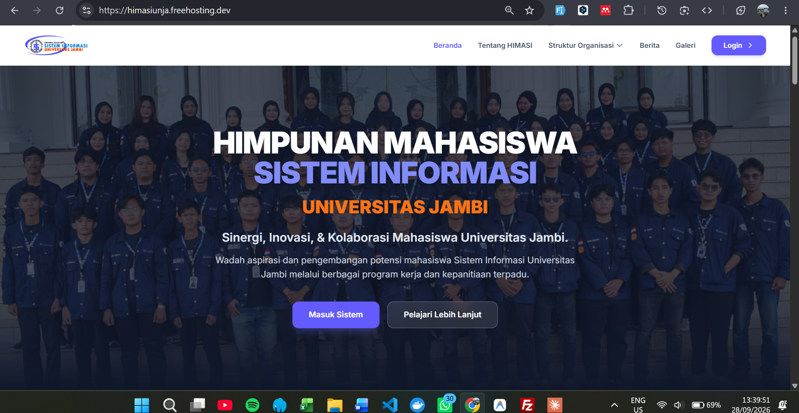

<p align="center">
  
</p>

<h1 align="center">HIMASI Management System</h1>

<p align="center">
  <strong>Sistem Informasi Manajemen Himpunan Mahasiswa Sistem Informasi</strong><br>
  Universitas Jambi
</p>

<p align="center">
  
  
  
  
  
  
</p>

<p align="center">
  <a href="https://himasiunja.freehosting.dev">🌐 Live Demo</a> •
  <a href="#fitur-utama">✨ Fitur</a> •
  <a href="#tech-stack">💻 Tech Stack</a> •
  <a href="#instalasi">🚀 Instalasi</a> •
  <a href="#role--hak-akses">🔐 Roles</a>
</p>

---

## 📸 Preview

<p align="center">
  
</p>

---

## 📋 Tentang Proyek

**HIMASI Management System** adalah platform Sistem Informasi Manajemen berbasis web yang dirancang khusus untuk mendigitalisasi dan mengoptimalkan seluruh operasional internal **Himpunan Mahasiswa Sistem Informasi (HIMASI) Universitas Jambi**.

Sistem ini bertindak sebagai pusat kendali (*central hub*) yang menghubungkan seluruh pengurus, divisi, dan kepanitiaan dalam satu ekosistem digital yang terintegrasi — menggantikan proses manual yang tidak efisien dengan alur kerja digital yang terstruktur dan transparan.

---

## ✨ Fitur Utama

### 🏛️ Manajemen Kepengurusan
| Fitur | Deskripsi |
|-------|-----------|
| **Struktur Organisasi Dinamis** | Mengelola periode kepengurusan, BPH, Dewan Penasihat, divisi, dan sub-divisi secara fleksibel |
| **Buku Direktori Anggota** | Direktori lengkap seluruh pengurus aktif dengan pencarian dan filter |
| **Dashboard Berbasis Peran** | Setiap peran (Kahim, Sekretaris, Bendahara, Kadiv, Anggota) memiliki dashboard khusus |
| **Profil & Avatar** | Setiap anggota memiliki profil lengkap dengan foto avatar |

### 📋 Program Kerja (Proker)
| Fitur | Deskripsi |
|-------|-----------|
| **CRUD Program Kerja** | Kadiv dapat membuat, mengedit, dan mengelola proker divisinya |
| **Jurnal & Log Kegiatan** | Pencatatan aktivitas dan progres setiap proker secara real-time |
| **Tracking Progres** | Monitoring status dan persentase penyelesaian proker lintas divisi |
| **Kolaborasi Lintas Divisi** | Proker dapat melibatkan anggota dari divisi berbeda |

### 🎪 Manajemen Kepanitiaan (Event)
| Fitur | Deskripsi |
|-------|-----------|
| **Pembuatan Event** | Membuat event/kegiatan dengan struktur kepanitiaan lengkap |
| **Manajemen Tim** | Ketupel dapat menambah, mengubah, dan menghapus anggota panitia |
| **Sistem Sprint & Tugas** | CO Divisi dapat membuat sprint dan mendistribusikan tugas ke anggota |
| **Review & Approval Tugas** | Alur review tugas dari anggota → CO → Ketupel |
| **RAB (Rancangan Anggaran Biaya)** | Pengelolaan anggaran per divisi kepanitiaan dengan cetak PDF |
| **Rapat Kepanitiaan** | Pencatatan jadwal rapat, absensi, dan notulensi |

### 📝 Kesekretariatan & Arsip
| Fitur | Deskripsi |
|-------|-----------|
| **Surat Organisasi** | Pembuatan dan pengelolaan surat resmi himpunan |
| **Pengajuan Surat Event** | Alur pengajuan surat dari Sekpel → Sekretaris HIMA dengan approval/revisi |
| **Template Dokumen** | Penyimpanan dan pengelolaan template dokumen organisasi |
| **Arsip Vital** | Penyimpanan dokumen-dokumen penting organisasi |
| **Notulensi Rapat** | Pencatatan hasil rapat beserta daftar hadir |

### 💰 Keuangan
| Fitur | Deskripsi |
|-------|-----------|
| **Kas & Transaksi** | Pencatatan pemasukan dan pengeluaran kas himpunan |
| **Laporan Keuangan** | Dashboard ringkasan keuangan dengan visualisasi |
| **Cetak Laporan PDF** | Export laporan keuangan ke format PDF |

### 💬 Messaging
| Fitur | Deskripsi |
|-------|-----------|
| **Channel Group Chat** | Komunikasi internal antar pengurus melalui channel |
| **File Sharing** | Berbagi file dan dokumen langsung di dalam chat |

### 🌐 Halaman Publik
| Fitur | Deskripsi |
|-------|-----------|
| **Beranda** | Landing page dengan informasi umum HIMASI |
| **Tentang HIMASI** | Halaman profil organisasi |
| **Struktur Organisasi** | Tampilan visual struktur kepengurusan aktif beserta foto |
| **Detail Divisi** | Informasi lengkap setiap divisi dan program kerjanya |
| **Galeri & Berita** | Dokumentasi kegiatan dan berita terkini |

---

## 💻 Tech Stack

### Backend
| Teknologi | Versi | Fungsi |
|-----------|-------|--------|
| **Laravel** | 12.x | Framework PHP utama (routing, ORM, auth, middleware) |
| **PHP** | 8.2+ | Bahasa pemrograman server-side |
| **MySQL** | 8.0 | Sistem manajemen basis data relasional |
| **Laravel Breeze** | 2.x | Starter kit autentikasi (login, register, reset password) |
| **DomPDF** | - | Library untuk generate dokumen PDF |

### Frontend
| Teknologi | Versi | Fungsi |
|-----------|-------|--------|
| **Tailwind CSS** | 3.x | Framework CSS utility-first untuk desain responsive |
| **Alpine.js** | 3.x | Framework JavaScript ringan untuk interaktivitas UI |
| **Vite** | 7.x | Build tool modern untuk bundling & optimasi aset |
| **Blade** | - | Template engine bawaan Laravel |

### DevOps & Tools
| Teknologi | Fungsi |
|-----------|--------|
| **Git & GitHub** | Version control & repository hosting |
| **Composer** | Dependency manager untuk PHP |
| **NPM** | Dependency manager untuk Node.js |
| **Pest PHP** | Testing framework |

---

## 🔐 Role & Hak Akses

Sistem ini menerapkan **Role-Based Access Control (RBAC)** dengan peran berlapis:

### Kepengurusan (Organisasi)
| Role | Akses |
|------|-------|
| **Super Admin** | Manajemen periode, anggota, divisi, dan konfigurasi sistem |
| **Pembina** | Monitoring dan overview seluruh aktivitas organisasi |
| **Dewan Penasihat (DP)** | Dashboard monitoring dan pemberian arahan |
| **Ketua Himpunan (Kahim)** | Dashboard eksekutif, monitoring aktivitas dan agenda |
| **Sekretaris** | Arsip surat, template dokumen, notulensi rapat, arsip vital |
| **Bendahara** | Manajemen kas, transaksi keuangan, cetak laporan |
| **Kepala Divisi (Kadiv)** | Manajemen proker divisi, monitoring progres anggota |
| **Anggota** | Jurnal proker, pengerjaan tugas, akses informasi divisi |

### Kepanitiaan (Event)
| Role | Akses |
|------|-------|
| **Ketua Pelaksana (Ketupel)** | Dashboard event, manajemen tim & divisi, RAB, progres |
| **Wakil Ketua Pelaksana** | Sama dengan Ketupel |
| **Sekretaris Pelaksana (Sekpel)** | Pengajuan surat, notulensi rapat kepanitiaan |
| **Bendahara Pelaksana (Benpel)** | RAB kepanitiaan |
| **CO Divisi** | Sprint & tugas divisi, RAB divisi, review tugas anggota |
| **Anggota Panitia** | Pengerjaan tugas, update status |

---

## 🚀 Instalasi

### Prasyarat
- PHP >= 8.2
- Composer
- Node.js >= 18
- MySQL 8.0
- Git

### Langkah Instalasi

```bash
# 1. Clone repository
git clone https://github.com/Wahyudin0701/himasi-unja.git
cd himasi-unja

# 2. Install dependensi PHP
composer install

# 3. Install dependensi Node.js
npm install

# 4. Salin file konfigurasi
cp .env.example .env

# 5. Generate application key
php artisan key:generate

# 6. Konfigurasi database di file .env
# Sesuaikan DB_DATABASE, DB_USERNAME, dan DB_PASSWORD

# 7. Jalankan migrasi dan seeder
php artisan migrate --seed

# 8. Buat symbolic link untuk storage
php artisan storage:link

# 9. Build aset frontend
npm run build

# 10. Jalankan server development
php artisan serve
```

Akses aplikasi di: `http://localhost:8000`

### Menjalankan Development Server (Hot Reload)

```bash
# Terminal 1: Laravel server
php artisan serve

# Terminal 2: Vite dev server (untuk hot reload CSS/JS)
npm run dev
```

---

## 📂 Struktur Proyek

```
himasi-unja/
├── app/
│   ├── Http/
│   │   └── Controllers/
│   │       ├── Kepengurusan/       # Controller kepengurusan (Kahim, Sekretaris, Bendahara, Kadiv, Anggota)
│   │       ├── Kepanitiaan/        # Controller kepanitiaan (Ketupel, CO, Sekpel, Anggota)
│   │       ├── Messaging/          # Controller messaging/chat
│   │       ├── SuperAdmin/         # Controller super admin
│   │       └── ProfileController   # Controller profil user
│   ├── Models/
│   │   ├── Kepengurusan/           # Model: Division, Member, WorkProgram, dll.
│   │   └── Kepanitiaan/           # Model: Event, EventDivision, EventCommittee, dll.
│   └── View/                      # View Components
├── config/                        # Konfigurasi aplikasi
├── database/
│   ├── migrations/                # 40+ migration files
│   └── seeders/                   # Seeder data awal (Periode, Divisi, Jabatan, Proker)
├── public/                        # Assets publik (gambar, build output)
├── resources/
│   ├── css/                       # Tailwind CSS source
│   ├── js/                        # Alpine.js source
│   └── views/                     # Blade templates
├── routes/
│   ├── web.php                    # Route publik & dashboard redirect
│   ├── auth.php                   # Route autentikasi (Breeze)
│   ├── kepengurusan.php           # Route modul kepengurusan
│   ├── kepanitiaan.php            # Route modul kepanitiaan
│   ├── super_admin.php            # Route super admin
│   ├── progress-report.php        # Route progress report
│   └── arsip.php                  # Route arsip
├── storage/                       # File upload, cache, logs
├── .env.example                   # Template konfigurasi environment
├── composer.json                  # Dependensi PHP
├── package.json                   # Dependensi Node.js
├── tailwind.config.js             # Konfigurasi Tailwind CSS
└── vite.config.js                 # Konfigurasi Vite
```

---

## 🗄️ Database Schema

Sistem ini menggunakan **40+ tabel** yang mencakup seluruh kebutuhan operasional organisasi:

| Kategori | Tabel |
|----------|-------|
| **Kepengurusan** | `periods`, `divisions`, `org_positions`, `users`, `members` |
| **Program Kerja** | `work_programs`, `proker_logs` |
| **Kepanitiaan** | `events`, `event_divisions`, `event_committees`, `committee_roles` |
| **Tugas & Sprint** | `work_tasks`, `division_sprints`, `progress_reports` |
| **Keuangan** | `finance_transactions`, `rabs` |
| **Kesekretariatan** | `letters`, `event_letters`, `organization_letters`, `document_templates`, `vital_archives` |
| **Rapat** | `meetings`, `meeting_attendances`, `event_meetings` |
| **Event Detail** | `rundowns`, `guests`, `sponsors`, `design_assets`, `certificates` |
| **Inventaris** | `inventories`, `inventory_loans`, `medical_inventories`, `violations` |
| **Messaging** | `channels`, `channel_members`, `messages`, `message_reads` |
| **Sistem** | `cache`, `jobs`, `sessions` |

---

## 🌐 Live Demo

🔗 **[https://himasiunja.freehosting.dev](https://himasiunja.freehosting.dev)**

---

## 📄 Lisensi

Proyek ini dikembangkan untuk keperluan internal HIMASI Universitas Jambi.
